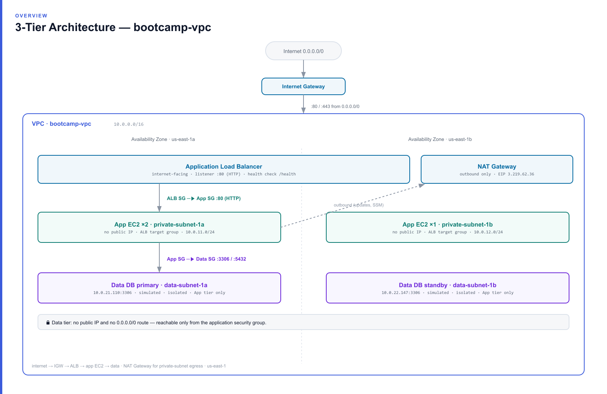

# Architecture

A production-shaped **3-tier web application** on AWS: an internet-facing load balancer in front of a stateless application fleet, backed by an isolated data tier. Everything runs inside a single VPC spread across **two Availability Zones** for high availability.

> Diagrams (`architecture/`): [architecture-diagram.png](architecture/architecture-diagram.png) · [network-diagram.png](architecture/network-diagram.png) · [security-groups-diagram.png](architecture/security-groups-diagram.png) · [traffic-flow-diagram.png](architecture/traffic-flow-diagram.png). An interactive HTML version is also included ([architecture-diagram.html](architecture/architecture-diagram.html)).



## Component overview

| Layer | Resource | ID | Purpose |
|---|---|---|---|
| Network | VPC `bootcamp-vpc` | `vpc-0917ed6d87b005f58` | 10.0.0.0/16 network boundary |
| Network | Internet Gateway `bootcamp-igw` | `igw-0b05f13160e05bfc8` | Ingress/egress for public subnets |
| Network | NAT Gateway `bootcamp-nat-1a` | `nat-0a456faf68c5e5724` | Outbound-only internet for private subnets (EIP 3.219.62.36) |
| Tier 1 | Application Load Balancer `ce-app-alb` | internet-facing | HTTP :80 **and HTTPS :443 (ACM)** entry point, spreads traffic across AZs |
| Tier 2 | Auto Scaling Group `ce-app-asg` (min 3 / desired 3 / max 4) | `lt-084477dff93c22b43` | Stateless web app on t3.micro/AL2023; target group members; CPU target-tracking scaling |
| Tier 3 | 1× EC2 `data-db` (simulated DB) | `i-02bb4326af4a8a7b2` | Data store placeholder on :3306 |

## Network design

### CIDR plan

VPC: **10.0.0.0/16** (65,536 addresses — deliberate headroom, avoids the "/28 too-small" pitfall).

| Tier | AZ us-east-1a | AZ us-east-1b | Sizing |
|---|---|---|---|
| Presentation (public) | `10.0.1.0/24` | `10.0.2.0/24` | /24 = 251 usable each |
| Application (private) | `10.0.11.0/24` | `10.0.12.0/24` | /24 |
| Data (private, isolated) | `10.0.21.0/24` | `10.0.22.0/24` | /24 |

**Rationale — the octet scheme encodes meaning:** the third octet tells you the tier (`1–2` = public, `11–12` = app, `21–22` = data) and the AZ (`x1` = 1a, `x2` = 1b). This makes route tables, security-group rules, and log lines self-documenting. Every subnet is a /24 for generous host space with room to add more tiers/AZs later.

### Routing

| Route table | Associated subnets | 0.0.0.0/0 route | Effect |
|---|---|---|---|
| `public-rt` | 2 public | → Internet Gateway | Full inbound/outbound internet |
| `app-rt` | 2 app-private | → NAT Gateway | **Outbound-only** (patching, package installs) |
| `data-rt` | 2 data-private | *(none — local only)* | **Fully isolated**, no internet path at all |

Splitting the data tier onto its own route table with **no default route** is the key design decision: even if a security-group rule were misconfigured, the data subnets have no network path to or from the internet.

## Traffic flow

```
Client ──HTTP:80──▶ Internet Gateway ──▶ ALB (public subnets)
                                           │  forward (target group, /health)
                                           ▼
                             App EC2 ×3 (private subnets)     App SG ⟵ ALB SG :80
                                           │  TCP:3306
                                           ▼
                                Data DB (isolated subnet)     Data SG ⟵ App SG :3306/5432

Outbound (app only): App EC2 ──▶ NAT Gateway ──▶ IGW ──▶ Internet   (updates, SSM)
```

## The application

A dependency-light Python service (`app/app.py`, stdlib only) run as a `systemd` unit on port 80. Each instance:
- reads its **instance-id** and **AZ** from IMDSv2,
- reports **data-tier reachability** by opening a TCP socket to the DB on :3306,
- serves a human page at `/` and a JSON **`/health`** endpoint used by the ALB.

Being stateless, any instance can serve any request, which is what makes horizontal scaling and failover trivial.

## High availability

- **Multi-AZ everywhere:** subnets, app instances, and the ALB all span us-east-1a + us-east-1b. Loss of one AZ leaves working capacity in the other.
- **Health-checked rotation:** the ALB polls `/health` every 10s and removes unhealthy targets within ~20s (see `tests/failover-test.md`).
- **Self-healing app:** the `systemd` unit is `enabled`, so the app restarts on boot; a recovered instance auto-rejoins the target group.
- **Stateless tier:** no session affinity required; requests are freely balanced.

### Implemented should-haves (bonus)
- **Auto Scaling Group** `ce-app-asg` — replaces the fixed instances; a failed instance is launched fresh automatically, and a **CPU target-tracking** policy (50%) scales 3→4 with load.
- **HTTPS listener** on the ALB (`:443`, ACM cert — self-signed for the demo).
- **VPC Flow Logs** (`fl-032b57de…` → CloudWatch) and **CloudWatch alarms** (unhealthy hosts, target 5XX).

### Current limitations (addressed in `IMPROVEMENTS.md`)
- **Single NAT Gateway** in AZ-a — if us-east-1a fails, private-subnet outbound breaks (a per-AZ NAT is the should-have fix).
- **Simulated single-node DB** — no managed backups/replication; RDS Multi-AZ is the production path.
- **Self-signed TLS cert** — a real deployment would use an ACM public cert with an owned domain.

## Management plane
Instances carry the `ec2-s3-cloudwatch-role` instance profile (`AmazonSSMManagedInstanceCore` + `CloudWatchAgentServerPolicy`). This enables **SSM Session Manager / Run Command** for administration with **no SSH keys, no bastion host, and no inbound ports open** on the private tiers — a meaningful security win over traditional SSH access.
